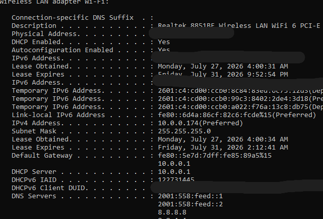
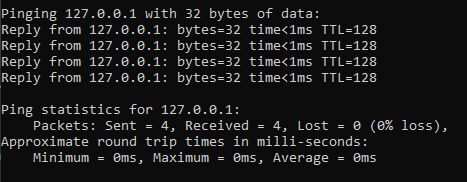
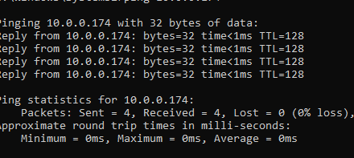
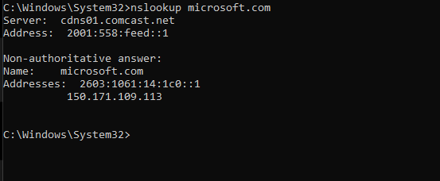
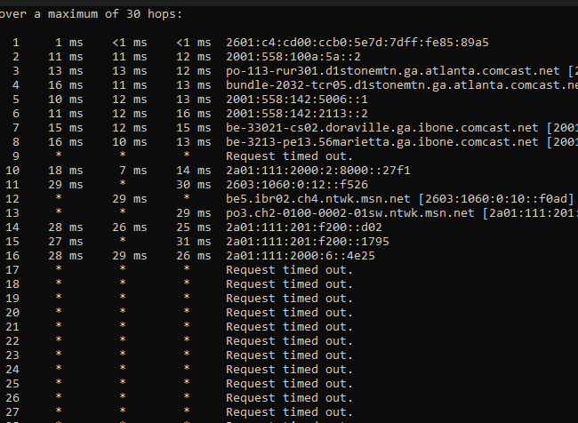
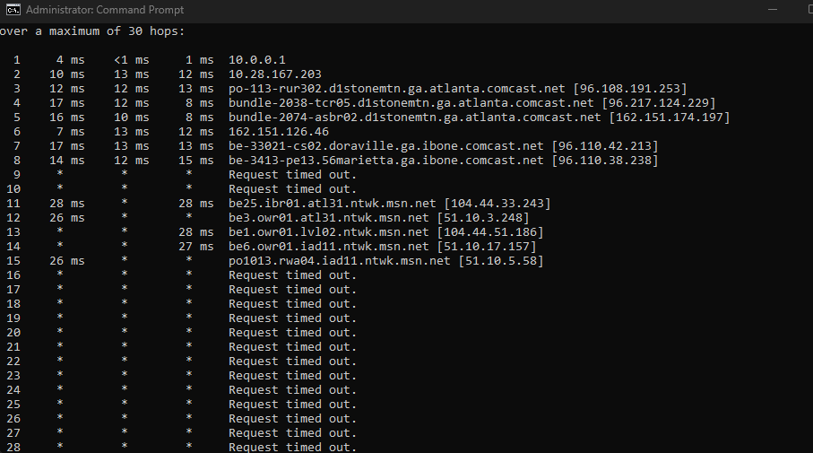
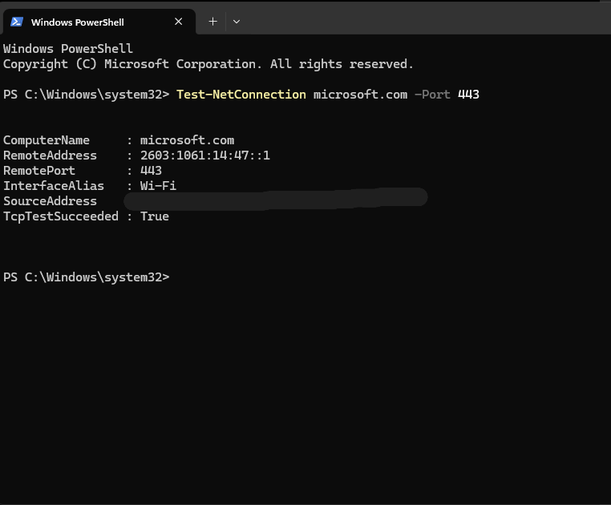

# Ticket 001 — No Internet Connection

## Ticket Information

**Technician:** Cameron Carter  
**Date:** July 29, 2026  
**Priority:** Medium  
**Status:** Resolved  
**Category:** Network Connectivity  

## Reported Issue

The user reports that their Windows computer is connected to Wi-Fi but cannot access websites.

## Questions Asked

1. When did the issue begin?
2. Is anyone else having the same problem?
3. Are you using Wi-Fi or Ethernet?
4. Can you access any websites?
5. Did anything change before the issue started?
6. Are you connected to a VPN?

## Possible Causes

- Wi-Fi connection issue
- Incorrect IP configuration
- Router problem
- DNS resolution issue
- VPN interference
- Firewall issue
- Internet service outage

## Troubleshooting Procedure

The reported issue was that the user appeared connected to Wi-Fi but could not
access websites. I tested the connection from the local computer outward to
identify where communication could be failing.

---

### Step 1 — Review Network Configuration

**Command:**

`ipconfig /all`

**What to Check:**

- Active network adapter
- DHCP status
- IPv4 address
- Subnet mask
- Default gateway
- DNS servers

**My Results:**

- Active adapter: Wireless LAN adapter Wi-Fi
- DHCP enabled: Yes
- IPv4 address: `10.0.0.174`
- Subnet mask: `255.255.255.0`
- Default gateway: `10.0.0.1`
- DHCP server: `10.0.0.1`
- DNS servers: IPv6 DNS servers and `8.8.8.8`

**Interpretation:**

The computer received a valid private IPv4 address through DHCP. Its IPv4
address and default gateway were on the same `/24` subnet. A gateway and DNS
servers were assigned, indicating a valid network configuration.

**Warning Signs:**

- IPv4 address begins with `169.254`
- Default gateway is blank
- DNS servers are missing
- Adapter says disconnected
- DHCP is enabled but no valid address was assigned

---

### Step 2 — Test the Local Networking Stack

**Command:**

`ping 127.0.0.1`

**My Result:**

- Sent: 4
- Received: 4
- Lost: 0
- Packet loss: 0%

**Interpretation:**

The loopback address responded successfully. This confirms that the local IP
networking stack is functioning.

**If It Failed:**

Investigate the Windows networking stack, network configuration, operating
system corruption, or security software interference.

---

### Step 3 — Test the Assigned Wi-Fi Address

**Command:**

`ping 10.0.0.174`

**My Result:**

- Sent: 4
- Received: 4
- Lost: 0
- Packet loss: 0%

**Interpretation:**

The computer successfully communicated using the IPv4 address assigned to its
Wi-Fi adapter.

**If It Failed:**

Investigate the wireless adapter, adapter driver, disabled interface, or
incorrect IP configuration.

---

### Step 4 — Test the Default Gateway

**Command:**

`ping 10.0.0.1`

**My Result:**

- Sent: 4
- Received: 4
- Lost: 0
- Packet loss: 0%
- Average response time: approximately 2 ms

**Interpretation:**

The computer successfully communicated with the local router over Wi-Fi.

**If It Failed:**

Investigate:

- Wi-Fi signal or connection
- Incorrect Wi-Fi network
- Wireless adapter
- Router or access point
- Incorrect subnet configuration
- Local firewall or network isolation

---

### Step 5 — Test External Internet Connectivity

**Command:**

`ping 8.8.8.8`

**My Result:**

- Sent: 4
- Received: 4
- Lost: 0
- Packet loss: 0%
- Average response time: approximately 14 ms

**Interpretation:**

The computer successfully reached an external internet IP address. This
confirms that traffic could pass through the router and reach the internet
without depending on DNS.

**If It Failed While the Gateway Worked:**

Investigate:

- ISP outage
- Router WAN connection
- Firewall or routing problem
- VPN interference
- Upstream network issue

---

### Step 6 — Test DNS Resolution

**Command:**

`nslookup microsoft.com`

**My Result:**

The configured Comcast DNS server returned both IPv4 and IPv6 addresses for
`microsoft.com`.

Example returned addresses included:

- IPv4: `150.171.109.70`
- IPv6: `2603:1061:14:71::1`

**Interpretation:**

The computer successfully contacted its DNS server and translated the domain
name into IP addresses. DNS resolution was functioning.

**If It Failed While 8.8.8.8 Worked:**

The problem would likely involve DNS.

Possible actions:

1. Verify the configured DNS servers with `ipconfig /all`.
2. Run `ipconfig /flushdns`.
3. Retest with `nslookup microsoft.com`.
4. Check VPN, proxy, or security software.
5. Escalate before changing corporate DNS settings.

---

### Step 7 — Trace the Network Route

**Commands:**

`tracert -4 microsoft.com`

`tracert -6 microsoft.com`

**My Results:**

Both traces progressed from the local network through Comcast infrastructure
and into Microsoft's network. Later routers did not respond to several
traceroute probes.

**Interpretation:**

The network path progressed beyond the local router and ISP toward Microsoft.
The later timeouts did not automatically indicate a connection failure because
some routers block or ignore traceroute traffic.

**What to Look For:**

- Failure immediately after the local gateway may suggest an ISP or router issue.
- Repeated failure beginning inside the local network may suggest a LAN issue.
- One isolated timeout between successful hops is usually not enough to prove
  an outage.
- Reaching the destination is helpful, but some destinations never reply to
  traceroute.

---

### Step 8 — Test the Website's HTTPS Port

**PowerShell Command:**

`Test-NetConnection microsoft.com -Port 443`

**My Results:**

- Remote address: `2603:1061:14:47::1`
- Remote port: `443`
- Interface: Wi-Fi
- TCP test succeeded: `True`

**Interpretation:**

The computer successfully established a TCP connection to Microsoft's HTTPS
service on port 443. This confirms that the website service was reachable over
the network.

**If DNS Worked but This Test Failed:**

Investigate:

- Firewall restrictions
- Proxy configuration
- VPN interference
- Blocked port 443
- Destination service outage
- Routing problem
- Security software filtering

---

## Troubleshooting Decision Guide

### Gateway Fails

Likely local connection problem:

- Wi-Fi
- Network adapter
- Router
- IP configuration
- Subnet mismatch

### Gateway Works but External IP Fails

Likely internet or routing problem:

- ISP outage
- Router WAN issue
- Firewall
- VPN
- Upstream routing

### External IP Works but DNS Fails

Likely DNS problem:

- Incorrect DNS configuration
- Unresponsive DNS server
- Corrupted local DNS cache
- VPN or security software interference

### DNS Works but Port 443 Fails

Likely service or traffic-filtering problem:

- Firewall
- Proxy
- VPN
- Port blocking
- Destination service issue

### DNS and Port 443 Work but Browser Fails

Likely application-level problem:

- Browser cache
- Browser extension
- Proxy settings
- Incorrect date and time
- Certificate issue
- Corrupted browser profile
- Hosts file entry
- Website-specific issue

---

## Final Resolution

No active network problem was reproduced during testing.

The computer had:

- A valid DHCP-assigned IP configuration
- A functioning local networking stack
- A functioning Wi-Fi adapter
- Successful communication with the default gateway
- Successful external internet connectivity
- Successful DNS resolution
- A valid route through the ISP toward Microsoft
- A successful TCP connection to HTTPS port 443

The reported website-access problem was documented as a troubleshooting
simulation. The diagnostic process demonstrated how to isolate failures at the
local system, adapter, gateway, internet, DNS, routing, and application-service
levels.

## Root Cause

No specific technical fault was identified because the reported issue could not
be reproduced during testing.

The computer had a valid network configuration and successfully passed tests
for the local networking stack, Wi-Fi interface, default gateway, external
internet connectivity, DNS resolution, network routing, and TCP port 443.

Because this was a simulated ticket, the root cause is recorded as:

**No fault found — issue not reproduced.**

Based on the diagnostic process, a real failure could have been caused by:

- DHCP or IP configuration problems
- Wi-Fi adapter or router connectivity problems
- ISP or upstream routing problems
- DNS resolution failure
- Firewall, proxy, or VPN interference
- Browser, certificate, extension, cache, or system-time problems

## Final Status

Closed — no fault found. The reported issue could not be reproduced, and
network connectivity was verified successfully.

# Supporting Screenshots

## 1. Network Configuration

The active Wi-Fi adapter received a valid DHCP-assigned IPv4 address, subnet
mask, default gateway, and DNS configuration.

---

## 2. Loopback Test

The loopback address responded with 0% packet loss, confirming that the local
IP networking stack was functioning.

---

## 3. Assigned Wi-Fi IPv4 Test

The assigned Wi-Fi IPv4 address responded with 0% packet loss, confirming that
Windows could communicate using the address assigned to the wireless adapter.

---

## 4. Gateway and External Connectivity

The default gateway `10.0.0.1` and external IP address `8.8.8.8` both
responded with 0% packet loss. This confirmed local router communication and
external internet connectivity independently of DNS.

---

## 5. DNS Resolution

The configured DNS server successfully resolved `microsoft.com` to IPv4 and
IPv6 addresses.

---

## 6. IPv6 Route Trace

The IPv6 trace progressed from the local gateway through Comcast infrastructure
and into Microsoft's network. Later timeouts did not prove an outage because
some routers do not respond to traceroute probes.

---

## 7. IPv4 Route Trace

The IPv4 trace progressed through the local gateway, Comcast network, and
Microsoft network. Later devices stopped responding to diagnostic probes.

---

## 8. HTTPS Port 443 Test

`TcpTestSucceeded: True` confirmed that the computer successfully established
a TCP connection to Microsoft's HTTPS service on port 443.
